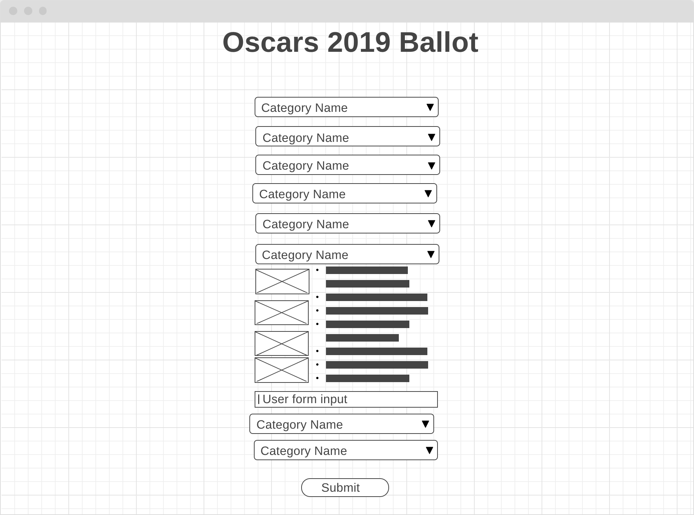
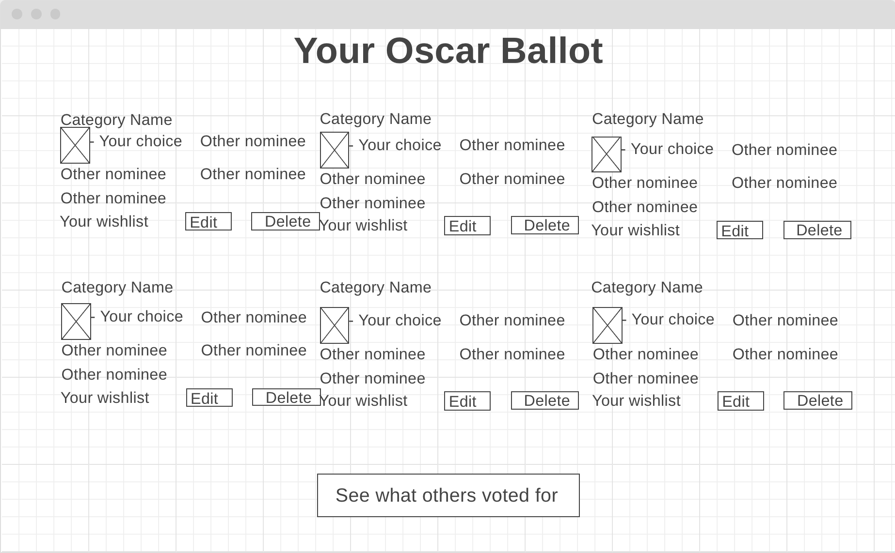
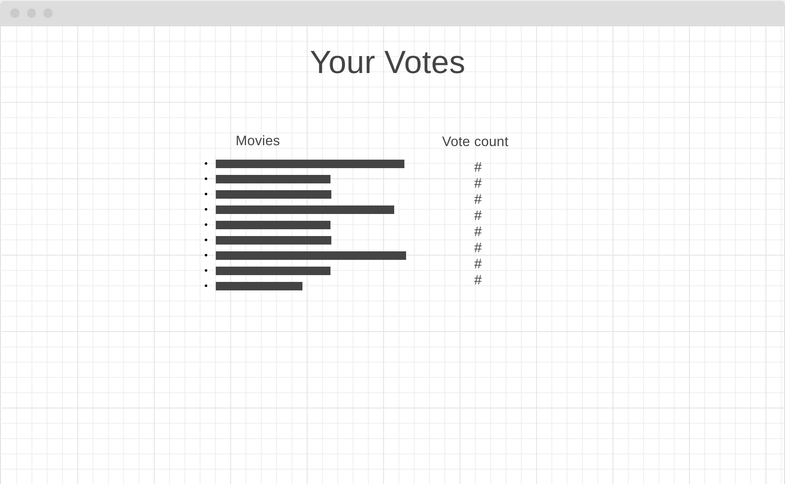

# Welcome to the Oscar Party!

### Overview
Oscar Party is an interactive Oscar ballot for this year's 91st Academy Awards.  Users can click on the film or individual they think will win or they want to win, and they can also submit their pick for who they wish was nominated.  After selecting a movie for each category, an overall ballot will be populated with their choices as well as their submissions.  On this ballot page, they can edit or delete their submissions.  They can then go to a vote count page that displays the top 10 movies with the most votes as well as every user submitted movie.

---
## Technologies Used
- HTML
- CSS
- JavaScript
- jQuery
- Node.js
- Express.js
- MongoDB
- Mongoose
- Bootstrap
- Google Fonts

---
## Our Process/Approach
We brainstormed ideas for the project, and we decided on the Oscars since the ceremony is the Sunday after our project is due and because it has a set data collection of nominees and categories.

We started by drawing out wireframes to visually see what content we wanted on the page and to think through the user journey.  Our main goal throughout the project was to stick to our MVP.

We created our folder structure, built basic HTML pages, created seed data, server routes, models and JavaScript files.  Then we worked on the JavaScript functionality to populate the landing page with our seed data and click functions to choose a movie, submit choices and user submitted movies and store all of them to memory.

Once we were able to accomplish those things, we advanced to the ballot page.  We worked on grabbing the stored choices and reflecting those amongst the nominations.  We struggled with getting the user submitted movies on the page, and while we continued to try to solve that, we worked on increasing a property of vote count for each movie when it is clicked on.

We finally started work on the vote count page to reflect the top movies as well as all of the user submitted movies.

After seeking help from instructors, we came up with a way to show the user submitted movies in each category.

Our last priority was styling our pages.

---
## Unsolved Problems
- Lots of global variables used in order to access in multiple functions
- Functionality to add another user submitted movie after deleting their first

---
## Our Biggest Wins and Challenges
Our biggest wins were when we solved our biggest challenges.
- Reflecting user choice and user submissions both on the landing page and especially carrying it over to the ballot page
- Getting the categories to collapse or show upon clicking
- Utilizing sessionStorage
- Creating entries in the database of user submitted movies upon submit click/function
- Increasing vote count
